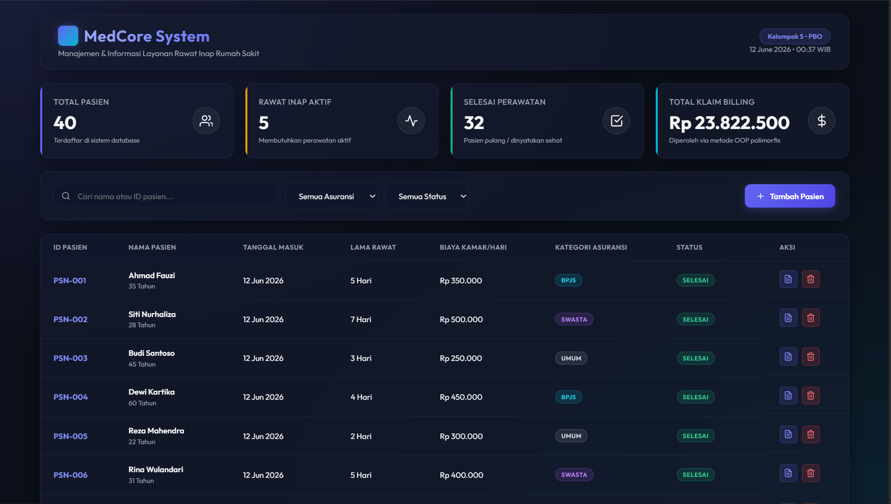
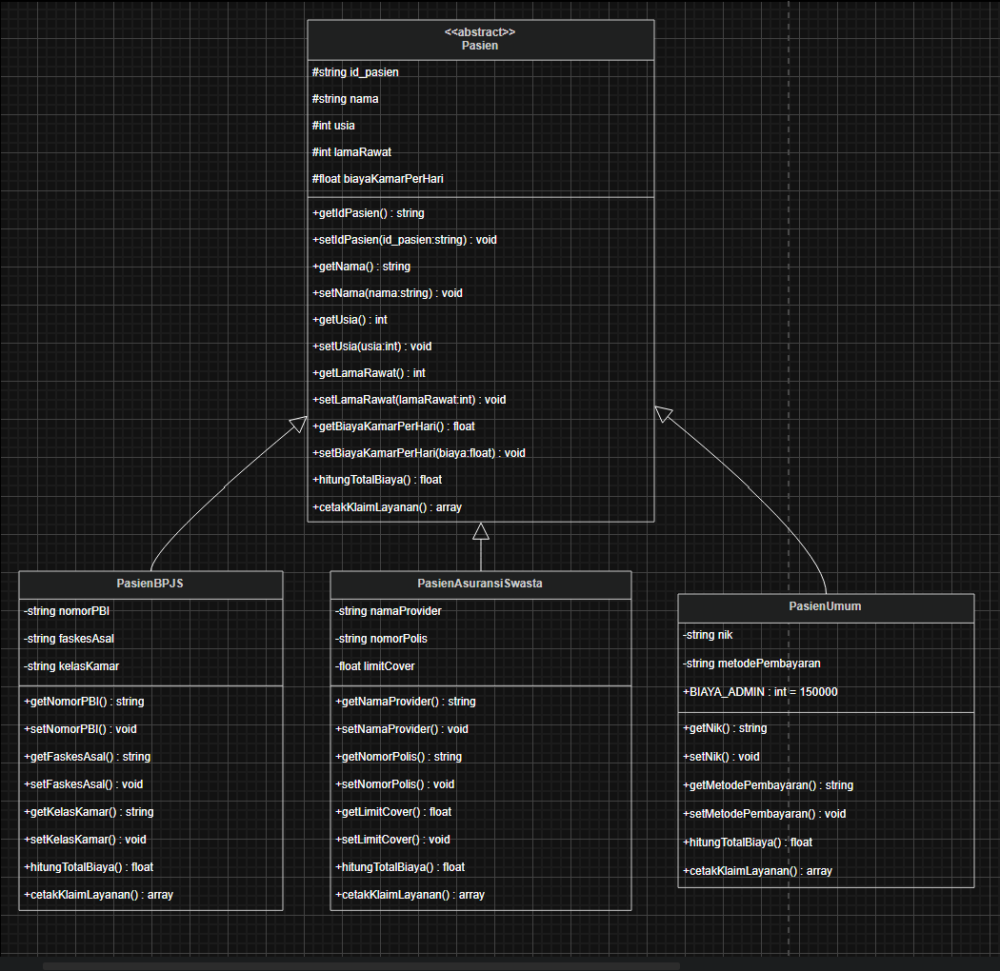

# 🏥 Sistem Manajemen Layanan Medis & BPJS Rumah Sakit — Kelompok 5 (Kasus B)




Sistem backend ini dibangun khusus menggunakan bahasa pemrograman **PHP Murni berorientasi objek (Pure OOP)** tanpa framework, terintegrasi penuh dengan basis data **MySQL**. Aplikasi ini dirancang untuk mengelola tata kelola rekam medis pasien, klasifikasi penjamin kesehatan, serta kalkulasi otomatis komponen beban biaya rawat inap berdasarkan ragam regulasi bisnis penjamin (BPJS Kesehatan, Asuransi Swasta, atau Pasien Umum/Mandiri).

Dokumen ini disusun sebagai **manifes utama proyek dan laporan resmi pengganti format PDF** sesuai dengan regulasi penugasan Pemrograman Berorientasi Objek.

---

## 👥 1. Matriks Distribusi Tanggung Jawab Anggota (Logbook Utama)

Guna memastikan objektivitas penilaian individu berdasarkan beban kerja (_workload_) yang adil dan merata, berikut adalah matriks pembagian peran, tanggung jawab, dan aktivitas teknis mandiri dari 5 anggota Kelompok 5 yang terekam secara berkala pada grafik kontribusi _commit history_ GitHub:

| Peran & Tanggung Jawab Utama                              | Nama Anggota Kelompok 5      | Deskripsi Aktivitas Teknis Mandiri (Scope of Work)                                                                                                                                                                                       |   Status   |
| :-------------------------------------------------------- | :--------------------------- | :--------------------------------------------------------------------------------------------------------------------------------------------------------------------------------------------------------------------------------------- | :--------: |
| **Job 1: Database Engineer & Data Access Layer (DAL)**    | **YAAFI YUMANA**             | Merancang skema basis data relasional `rumah_sakit.sql` (tabel induk & tabel penjamin), mengisolasi fungsi query CRUD dasar, serta membangun skrip otomatisasi _Smart Auto-Import Database_ untuk efisiensi deployment server lokal.     | ✅ Selesai |
| **Job 2: Software Architect & Core Abstraction**          | **DAPOT MATTHEW TAMPUBOLON** | Menyusun struktur arsitektur folder berbasis kode bersih (_clean architecture_), merancang fondasi _Master Abstract Class_ `Pasien.php`, menetapkan pembatasan _Access Modifier_, serta mendeklarasikan _abstract methods_ inti.         | ✅ Selesai |
| **Job 3: Subclass Developer & Business Logic Specialist** | **NABIL KUNDI HARTANTO**     | Mengembangkan kode konkrit pada seluruh kelas anak (_subclass_: `PasienBPJS`, `PasienAsuransiSwasta`, `PasienUmum`), menyusun enkapsulasi atribut unik, serta mengonstruksi formula matematis kalkulasi biaya kamar rawat inap.          | ✅ Selesai |
| **Job 4: Controller & Polymorphic Driver Specialist**     | **YAAFI YUMANA**             | Membangun komponen pengendali pusat `ManajemenRumahSakit.php`, mengimplementasikan arsitektur array heterogen (_Polymorphic Collection_), serta mengeksekusi pelaporan dinamis via _Dynamic Binding_ saat _runtime_.                     | ✅ Selesai |
| **Job 5: UML Designer & System Modeler**                  | **ALFARDHAN NUR IBNAN**      | Menganalisis spesifikasi kebutuhan kasus, memetakan visibilitas properti, tipe data parameter, serta mentransformasikan relasi pewarisan (_inheritance/generalization_) dan asosiasi ke dalam dokumen visual formal `Diagram Class.png`. | ✅ Selesai |
| **Job 6: Technical Writer & Documentation Specialist**    | **IRFAN FATIH RIZKI**        | Melakukan validasi pengujian silang antara skrip kode dengan pilar OOP, mengompilasi logbook aktivitas mingguan, serta menyusun struktur penyajian laporan komprehensif pada berkas `README.md`.                                         | ✅ Selesai |

---

## 📂 2. Struktur Direktori Folder Proyek

Aplikasi ini diorganisasikan menggunakan struktur kode modular yang memisahkan antara logika inti bisnis (_backend logic_) dengan antarmuka paparan data (_presentation layer_):

```text
kelompok_5_manajemen_rumah_sakit/
├── public/                         # Folder akses publik web server
│   ├── assets/                     # Aset gambar dokumentasi sistem
│   │   └── Diagram Class.png       # Gambar Utama Arsitektur UML Class Diagram
│   └── index.php                   # Halaman utama aplikasi (Driver / Presentation View)
├── src/                            # Source Code Utama (Core Backend Aplikasi)
│   ├── Controllers/
│   │   └── ManajemenRumahSakit.php # Pengendali logika bisnis & Polymorphic Collection
│   ├── Core/
│   │   └── Pasien.php              # Master Abstract Class (Cetak Biru Induk Utama)
│   ├── Database/
│   │   ├── KoneksiDatabase.php     # Data Access Layer & Singleton Database Instance
│   │   └── rumah_sakit.sql         # Skrip Struktur Skema Tabel & Data Seeding MySQL
│   └── Models/
│       ├── PasienAsuransiSwasta.php# Subclass Khusus Pasien Jaminan Asuransi Swasta
│       ├── PasienBPJS.php           # Subclass Khusus Pasien Jaminan BPJS Kesehatan
│       └── PasienUmum.php           # Subclass Khusus Pasien Umum / Mandiri
└── README.md                       # Manifes Dokumentasi Utama Proyek (Pengganti Laporan)

📐 3. Arsitektur Perangkat Lunak (UML Class Diagram)
Berikut adalah diagram kelas resmi yang menggambarkan visualisasi pemetaan struktur data, tingkat visibilitas properti (protected dan private), parameter konstruktor, tipe data kembalian (return type), serta relasi pewarisan bertingkat dari sistem manajemen rumah sakit kelompok kami:

Keterangan Hubungan Relasi:

Kelas PasienBPJS, PasienAsuransiSwasta, dan PasienUmum memiliki hubungan Generalisasi / Pewarisan (Inheritance) langsung ke kelas abstrak induk Pasien.

Kelas ManajemenRumahSakit sebagai Controller memiliki hubungan Asosiasi / Agregasi yang menampung koleksi objek bertipe kelas induk Pasien.

💻 4. Implementasi dan Penjelasan Mendalam Pilar OOP
Sistem ini mengintegrasikan empat pilar utama Pemrograman Berorientasi Objek secara ketat untuk menjamin reusabilitas dan skalabilitas kode:

A. Pilar Abstraksi (Abstraction)
Diterapkan pada berkas src/Core/Pasien.php menggunakan kata kunci abstract class. Kelas induk ini mengisolasi properti umum milik seluruh entitas pasien dan mendeklarasikan kontrak metode abstrak hitungTotalBiaya() serta cetakKlaimLayanan(). Kelas ini tidak dapat diinstansiasi secara langsung melainkan wajib diturunkan oleh sub-kelas konkrit.

namespace Src\Core;

abstract class Pasien {
    protected $id_pasien;
    protected $nama;
    protected $usia;
    protected $lamaRawat;
    protected $biayaKamarPerHari;

    public function __construct($id_pasien, $nama, $usia, $lamaRawat, $biayaKamarPerHari) {
        $this->id_pasien = $id_pasien;
        $this->nama = $nama;
        $this->usia = (int)$usia;
        $this->lamaRawat = (int)$lamaRawat;
        $this->biayaKamarPerHari = (float)$biayaKamarPerHari;
    }

    // Abstract Methods: Wajib diimplementasikan ulang oleh seluruh subclass konkrit
    abstract public function hitungTotalBiaya(): float;
    abstract public function cetakKlaimLayanan(): array;

    // Getter untuk kebutuhan Dynamic Binding di Controller
    public function getNama(): string { return $this->nama; }
    public function getIdPasien(): string { return $this->id_pasien; }
}

B. Pilar Enkapsulasi (Encapsulation) & Data Protection
Seluruh atribut unik yang berada pada kelas anak dilindungi dengan Access Modifier tingkat private. Akses baca dan modifikasi data dari luar kelas dikendalikan secara aman menggunakan fungsi Getter dan Setter. Di dalam fungsi Setter, disematkan validasi logika bisnis untuk menangkal anomali data (misal: nilai limit finansial tidak boleh minus).

// Contoh Enkapsulasi Ketat pada PasienAsuransiSwasta.php
namespace Src\Models;
use Src\Core\Pasien;

class PasienAsuransiSwasta extends Pasien {
    private $namaProvider;
    private $nomorPolis;
    private $limitCover;

    // Mutator (Setter) dengan Validasi Bisnis Terenkapsulasi
    public function setLimitCover(float $limitCover): void {
        if ($limitCover < 0) {
            throw new \InvalidArgumentException("Plafon limit perlindungan asuransi tidak boleh bernilai negatif.");
        }
        $this->limitCover = $limitCover;
    }

    public function getLimitCover(): float { return $this->limitCover; }
    public function getNamaProvider(): string { return $this->namaProvider; }
}

C. Pilar Pewarisan (Inheritance)
Sub-kelas menggunakan kata kunci extends untuk mewarisi sifat, atribut, dan perilaku dasar dari kelas abstrak Pasien. Pemanggilan fungsi konstruktor kelas induk dikerjakan secara efisien menggunakan perintah parent::__construct() untuk menghindari duplikasi penulisan kode (Don't Repeat Yourself).

namespace Src\Models;
use Src\Core\Pasien;

class PasienBPJS extends Pasien {
    private $nomorPBI;
    private $faskesAsal;
    private $kelasKamar;

    public function __construct($id_pasien, $nama, $usia, $lamaRawat, $biayaKamarPerHari, $nomorPBI, $faskesAsal, $kelasKamar) {
        // Memicu alokasi memori atribut pada constructor abstract class induk
        parent::__construct($id_pasien, $nama, $usia, $lamaRawat, $biayaKamarPerHari);
        $this->nomorPBI = $nomorPBI;
        $this->faskesAsal = $faskesAsal;
        $this->kelasKamar = $kelasKamar;
    }
}

D. Pilar Polimorfisme Overriding & Dynamic Binding
Polimorfisme diimplementasikan melalui teknik Method Overriding, di mana metode abstrak hitungTotalBiaya() ditulis ulang pada tiap kelas anak guna mengeksekusi perhitungan tarif finansial yang berbeda secara spesifik:

1. Pasien BPJS: Subsidi menanggung 90% tarif dasar, sehingga beban pasien hanya sebesar 10%

TOTAL BIAYA = (LAMA RAWAT X BIAYA KAMAR) X10%

2. Pasien Asuransi Swasta: Pasien hanya membayar sisa selisih biaya dasar apabila total akumulasi biaya melampaui limit perlindungan (limitCover). Jika di bawah limit, biaya bernilai Rp0.

3. Pasien Umum: Dikenakan tarif rawat inap secara utuh ditambah konstanta beban administrasi tambahan sebesar Rp150.000.

// 1. Overriding pada PasienBPJS.php
public function hitungTotalBiaya(): float {
    return ($this->lamaRawat * $this->biayaKamarPerHari) * 0.10;
}

// 2. Overriding pada PasienAsuransiSwasta.php
public function hitungTotalBiaya(): float {
    $biayaDasar = $this->lamaRawat * $this->biayaKamarPerHari;
    return ($biayaDasar > $this->limitCover) ? ($biayaDasar - $this->limitCover) : 0.0;
}

// 3. Overriding pada PasienUmum.php
public function hitungTotalBiaya(): float {
    $biayaAdministrasi Tambahan = 150000.0;
    return ($this->lamaRawat * $this->biayaKamarPerHari) + $biayaAdministrasiTambahan;
}

Melalui berkas Controller ManajemenRumahSakit.php, objek-objek heterogen ditampung ke dalam sebuah array koleksi polimorfik. Saat aplikasi mengeksekusi iterasi laporan, program memanfaatkan Dynamic Binding untuk memicu implementasi fungsi kalkulasi biaya yang tepat milik sub-kelas masing-masing pada saat runtime.

namespace Src\Controllers;
use Src\Core\Pasien;

class ManajemenRumahSakit {
    private array $polymorphicCollection = [];

    // Menerima parameter bertipe object abstract class Pasien
    public function tambahPasien(Pasien $pasien): void {
        $this->polymorphicCollection[] = $pasien;
    }

    public function getDaftarPasien(): array {
        return $this->polymorphicCollection;
    }
}

🗄️ 5. Data Access Layer & Otomatisasi Database
Aplikasi ini mengadopsi Design Pattern Singleton pada kelas KoneksiDatabase.php untuk membatasi instansiasi langsung melalui private function __construct(). Konfigurasi ini menjamin hanya ada satu koneksi database yang aktif (single instance) di memori server guna menghemat beban komputasi.

Aplikasi juga dilengkapi dengan fitur Smart Auto-Import Database. Saat berkas aplikasi pertama kali diakses lewat browser, sistem secara otomatis akan memeriksa eksistensi tabel pasien pada server MySQL lokal. Jika belum terbuat, skrip PHP akan langsung membaca dan mengeksekusi file src/Database/rumah_sakit.sql untuk membuat basis data rumah_sakit, struktur tabel relasional, serta melakukan pengisian data tiruan (data seeding) secara instan.

## 📅 6. Log Aktivitas Komit Harian Kelompok (Logbook 1-Week Sprint)

Dokumentasi di bawah ini merekam garis waktu pengembangan intensif sistem backend Kelompok 5 dalam jangka waktu 1 minggu, yang dipecah secara berurutan per hari tanpa format tabel agar lebih bersih dan mudah ditinjau:

### 📆 Hari 1 — Fondasi Arsitektur & Kelas Induk
* **Penanggung Jawab:** DAPOT MATTHEW TAMPUBOLON (Job 2)
* **Aktivitas Teknis:**
  * Menganalisis spesifikasi kebutuhan Kasus B (Sistem Rumah Sakit)
  * Merancang arsitektur folder proyek berbasis kode bersih (clean architecture)
  * Mengonstruksi Master Abstract Class `Pasien.php` dengan access modifier `protected`
  * Mendeklarasikan kontrak fungsi abstrak `hitungTotalBiaya()` dan `cetakKlaimLayanan()`
* **Status:** ✅ Selesai (Committed)

---

### 📆 Hari 2 — Perancangan Basis Data Relasional
* **Penanggung Jawab:** YAAFI YUMANA (Job 1)
* **Aktivitas Teknis:**
  * Merancang skema relasional database `rumah_sakit.sql` (tabel pasien & rekam medis)
  * Membuat data simulasi awal (data seeding) sebanyak 40 record pasien di dalam MySQL
  * Membangun kelas inti `KoneksiDatabase.php` menggunakan Design Pattern Singleton
  * Menyusun fungsi enkapsulasi query SQL CRUD dasar untuk interaksi data layer
* **Status:** ✅ Selesai (Committed)

---

### 📆 Hari 3 — Pengembangan Objek Kelas Anak
* **Penanggung Jawab:** NABIL KUNDI HARTANTO (Job 3)
* **Aktivitas Teknis:**
  * Mengembangkan kode konkrit pada seluruh kelas anak (`PasienBPJS`, `PasienAsuransi`, `PasienUmum`)
  * Mengenkapsulasi atribut unik sub-kelas menggunakan access modifier `private`
  * Membuat fungsi akses aman (Getter dan Setter) disertai logika validasi penanganan data
* **Status:** ✅ Selesai (Committed)

---

### 📆 Hari 4 — Implemetasi Rumus Polimorfisme Overriding
* **Penanggung Jawab:** NABIL KUNDI HARTANTO (Job 3)
* **Aktivitas Teknis:**
  * Menerapkan Method Overriding untuk formula matematis kalkulasi biaya BPJS (subsidi 10%)
  * Menerapkan logika Overriding perhitungan klaim Asuransi Swasta berdasarkan limit perlindungan
  * Menerapkan kalkulasi biaya Pasien Umum ditambah konstanta biaya administrasi rumah sakit
* **Status:** ✅ Selesai (Committed)

---

### 📆 Hari 5 — Pembuatan Komponen Controller Utama
* **Penanggung Jawab:** YAAFI YUMANA (Job 4)
* **Aktivitas Teknis:**
  * Membangun komponen pengendali terpusat pada berkas `ManajemenRumahSakit.php`
  * Mengimplementasikan penyimpanan data heterogen via Polymorphic Collection (Array objek Pasien)
  * Mengeksekusi mekanisme looping laporan menggunakan teknik Dynamic Binding saat runtime aplikasi
* **Status:** ✅ Selesai (Committed)

---

### 📆 Hari 6 — Integrasi Antarmuka & Pemetaan UML
* **Penanggung Jawab:** YAAFI YUMANA (Job 4) & ALFARDHAN NUR IBNAN (Job 5)
* **Aktivitas Teknis:**
  * Mengintegrasikan visualisasi data backend ke dalam Presentation View di file `public/index.php` (Yaafi)
  * Memetakan seluruh visibilitas kelas, tipe data parameter, dan relasi pewarisan sistem (Alfardhan)
  * Mentransformasikan arsitektur kelas menjadi file gambar visual standar `Diagram Class.png` (Alfardhan)
* **Status:** ✅ Selesai (Committed)

---

### 📆 Hari 7 — Otomatisasi, Pengujian, & Dokumentasi Final
* **Penanggung Jawab:** YAAFI YUMANA (Job 1) & IRFAN FATIH RIZKI (Job 6)
* **Aktivitas Teknis:**
  * Menyusun skrip otomatisasi database Smart Auto-Import untuk deployment lokal server (Yaafi)
  * Melakukan pengujian silang (cross-testing) validasi akurasi kalkulasi finansial sistem (Irfan)
  * Menyusun seluruh laporan manifes teknis dan pilar OOP ke dalam dokumen utama `README.md` (Irfan)
  * Membuat panduan instalasi lokal aplikasi menggunakan komponen XAMPP web server (Irfan)
  * Melakukan finalisasi peninjauan kode (code review), pembersihan bug, dan final push ke GitHub (Irfan)
* **Status:** 🚀 Rilis Final (Released)

---
```
